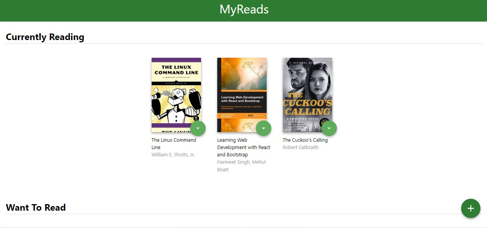
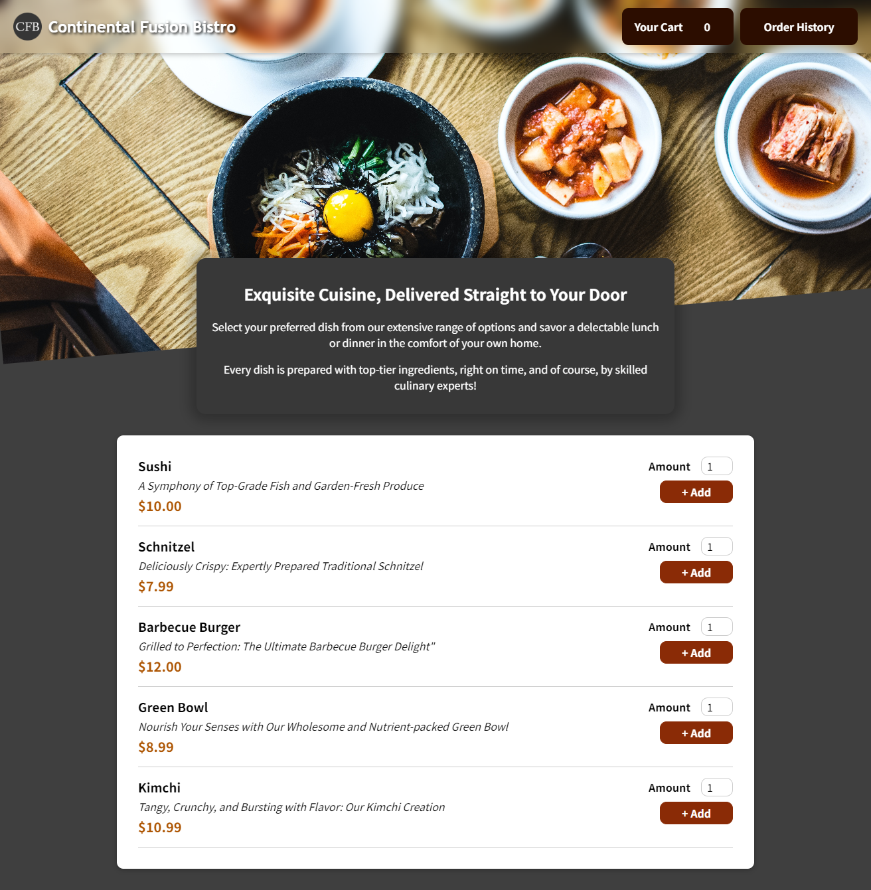
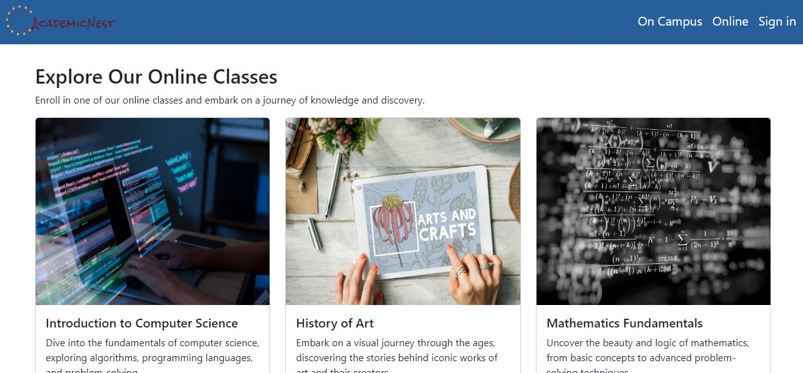

# Hi there || Merhaba || Hola!! 👋  I'm Merve! 🌟 Passionate Developer & Lifelong Learner

My name is Merve. Originally from Turkey, I currently reside in Spain. I'm fluent in both Turkish and English, with basic proficiency in Spanish.

## 🚀 Featured Projects

### [My Books](https://github.com/merv-e/my-books)
My-Books is a React-based web application that allows users to discover, search, and manage their book collections. Whether you're an avid reader or just looking for your next read, My-Books provides a user-friendly experience to organize your reading list. 

Check the [Demo](https://my-booooks.netlify.app) here!

------
 
### [Continental Fusion Bistro](https://github.com/merv-e/continental-fusion-bistro)
🌐🍽️ Welcome to Continental Fusion Bistro, a digital culinary haven where you can effortlessly order gourmet meals with just a click. This elegant web application, powered by React, Firebase, and CSS, offers a seamless and delightful dining experience. Join us on this gastronomic adventure and contribute to the future of Continental Fusion Bistro! 🚀🍳

-----
### [Academic Nest](https://github.com/merv-e/academic-nest)
This web application simulates a college website, offering students the choice between online and on-campus education. The project primarily focuses on creating an intuitive and visually appealing website layout. If you can't find links to classes, don't worry—it's intentional! 🙂

Explore the [live](https://academic-nest.netlify.app) version of Academic Nest on Netlify.

Feel free to dive into these projects and share your thoughts. I'm always open to collaboration and continually refining my work!

----
## 💖 My Hobbies

- **Music:** I'm an amateur flutist. Music is a fantastic way for me to express myself and explore creativity.

- **Psychology and Sociology:** Understanding people and societies deeply fascinates me. Every now and then I like reading some articles in psychology and sociology.

- **Science Fiction and Thrillers:** I'm an avid fan of science fiction and thriller films and series. Favorites include classics like "Alien (1978)," "The Thing," "Expanse," and many more.

- **Language Learning:** I have a keen interest in learning different languages and am constantly immersed in the process of picking up a new one.
